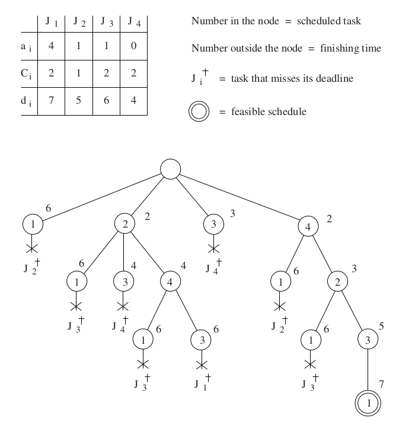

# bratley
C++ template metaprogramming implementation of Bratley's scheduling algorithm. The algorithm is computed at compile-time such that the schedule is known by run-time.

An example of the schedule tree generated using Bratley's scheduling algorithm can be seen in the figure below, where `J_i` are the tasks to be scheduled, `a_i` are the arrival times, `C_i` are the computation times, and `d_i` are the deadlines:



In the above tree the feasible schedule shown is `S = { J_4, J_2, J_3, J_1 }` because:

- `J_4` arrives at `t=0`, starts at `t=0`, finishes at `t=2`, and its finish time is less-than-or-equal-to its deadline at `t=4`
- `J_2` arrives at `t=1`, starts at `t=2`, finishes at `t=3`, and its finish time is less-than-or-equal-to its deadline at `t=5`
- `J_3` arrives at `t=1`, starts at `t=3`, finishes at `t=5`, and its finish time is less-than-or-equal-to its deadline at `t=6`
- `J_1` arrives at `t=4`, starts at `t=5`, finishes at `t=7`, and its finish time is less-than-or-equal-to its deadline at `t=7`

Build instructions:
```
cd bratley
mkdir build
cd build
cmake ..
make
```

Live demo on the Godbolt Compiler Explorer:

https://godbolt.org/z/P4G9fjnvh
